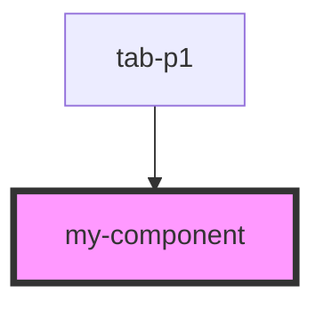

# my-component

<!-- Auto Generated Below -->

## Properties

| Property | Attribute | Description                                                                                     | Type     | Default     |
| -------- | --------- | ----------------------------------------------------------------------------------------------- | -------- | ----------- |
| `first`  | `first`   | The first name                                                                                  | `string` | `undefined` |
| `last`   | `last`    | The last name                                                                                   | `string` | `undefined` |
| `middle` | `middle`  | The middle name                                                                                 | `string` | `undefined` |
| `person` | --        | A typed object                                                                                  | `Person` | `undefined` |
| `ref`    | `ref`     | Enable REACT to get typesafe access this component while also get any access to the DOM element | `any`    | `undefined` |

## Dependencies

### Used by

 - [tab-p1](../../pages/tab-p1)

### Graph

----------------------------------------------

*Built with [StencilJS](https://stenciljs.com/)*
